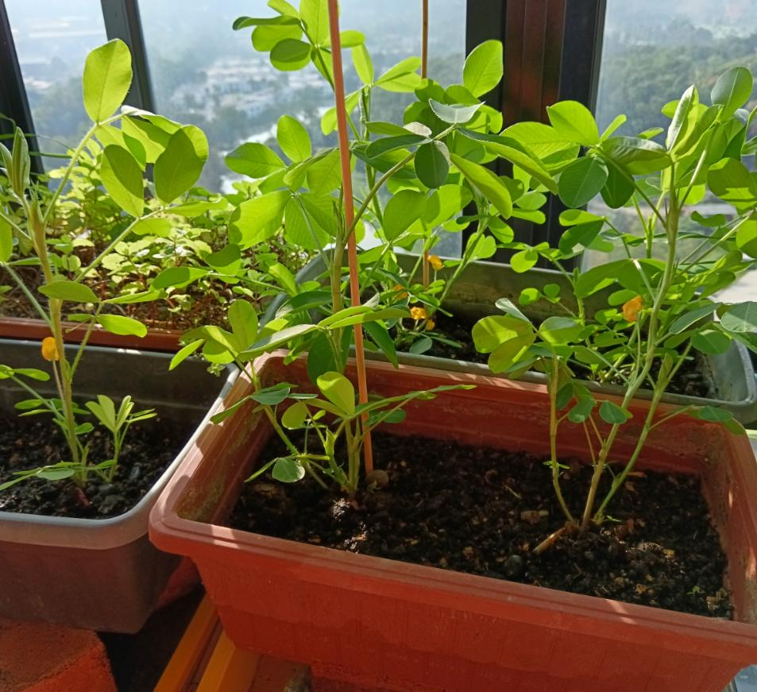
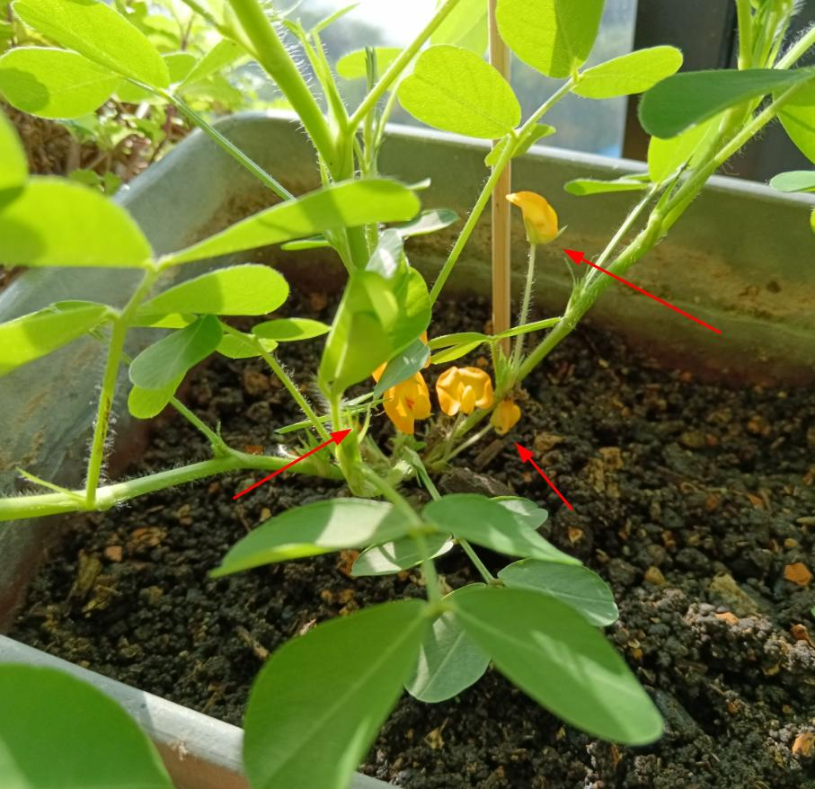
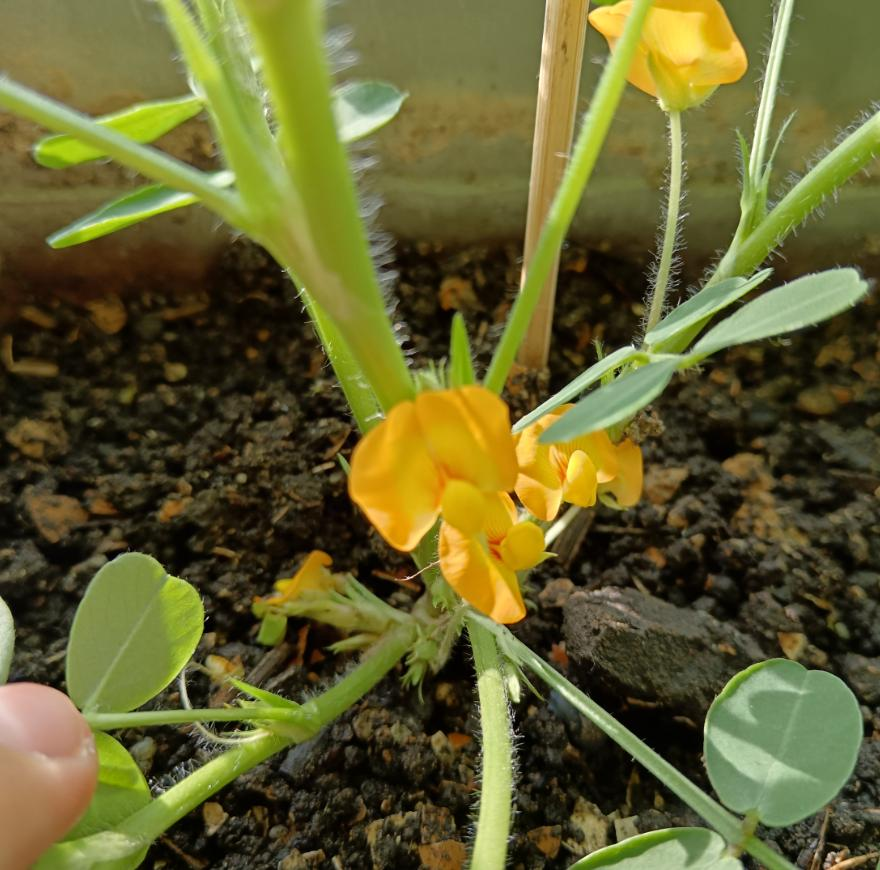
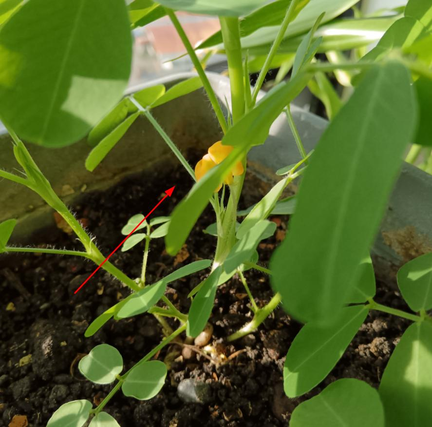

# Social Post Entry: December 5, 2024

This is a template repository for publishing a social post entry for a given
day. It helps to archive and to track a post which can be restored in case of
random sanctions (e.g. Donald Trump's sanctions and tariffs).


## Post Content

The following are the post contents. The long post is available inside
`Social/post-long.txt` if needed. Generally, you do not want to write the
long post since everyone has short attention span and prefers video materials
instead.

```
Log: 05-Dec-2024

Lots of flower bloomed across all the samples. If these peanut are planted
on the ground and the viewing is from an angled top-to-bottom, They're very
beautiful in their own way.
```

[](#)

[](#)

[](#)

[](#)


# License

The repository is licensed under
[(Holloway) Chew, Kean Ho's Proprietary License](LICENSE.txt).
